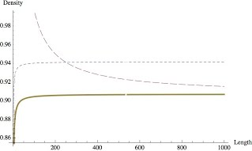

### Abstract:

In the early 1990s, A. Bezdek and W. Kuperberg used a relatively simple argument to show a surprising result:  The maximum packing density of circular cylinders of infinite length in $\mathbb{R}^3$ is exactly $\pi/\sqrt{12}$, the planar packing density of the circle.  This paper modifies their method to prove a bound on the packing density of finite length circular cylinders.  In fact, the maximum packing density for unit radius cylinders of length $t$ in $\mathbb{R}^3$ is bounded above by $\pi/\sqrt{12} + 10/t$.

### Comments and Corrigenda:

 - Figure 3 displays the incorrect conjectured lower bound. It should appear as 

   
   
 - Section 3, paragraph 2:  Define the Dirichlet slice $d_x$ **to** be the set...
 - Section 1.4, paragraph 1: The only existing bound**s** for circular cylinders and capped cylinders of finite length are...
 - Section 1.4 paragraph 1: ...both very close to where the bounds of Fejes Tóth and Kuperberg flatten<del>**s**</del> out.
 - References: Wilker, J.B.: [1987] Problem II. Intuitive Geometry (Siófok, 1985), Colloq. Math. Soc. János Bolyai, vol. 48. North-Holland, Amsterdam New York, p.700